# Disaster Recovery with ORDS

Disaster Recovery Network and connectivity setup
=======================================================

This solution provides a Network Architecture deployment to demonstrate Disaster Recovery scenario across 2 regions [ examples are geared towards region Ashburn & Phoenix and can be used for any OCI regions].


## Quickstart Deployment

1. Clone this repository to your local host. The `DR-ORDS-RW` directory contains the Terraform configurations for a sample topology based on the architecture described earlier.
    ```
    git clone https://github.com/Chavez-Saul/DR-ORDS-RW.git
    ```
2. Zip up all the files except fot for rackwaressaleplay and gitignore.
3. Make use to create a public bucket in object storage. Upload apex.zip and the ords.war file to the bucket.
    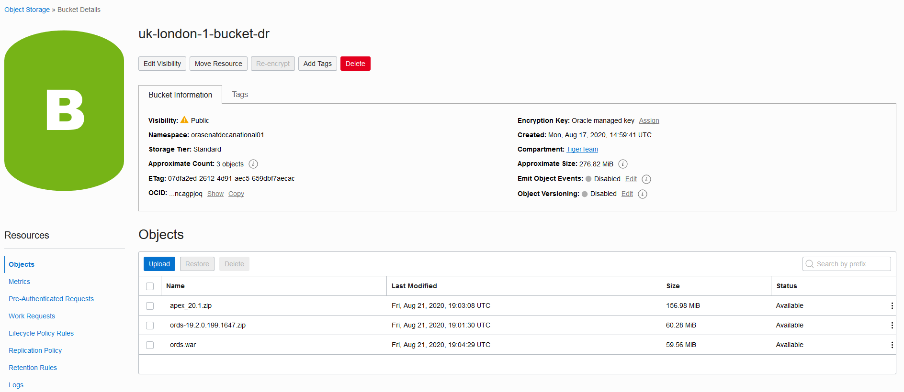
4. Navigate to the resource manager tab in OCI. Then create a new stack to import the zip file. 
    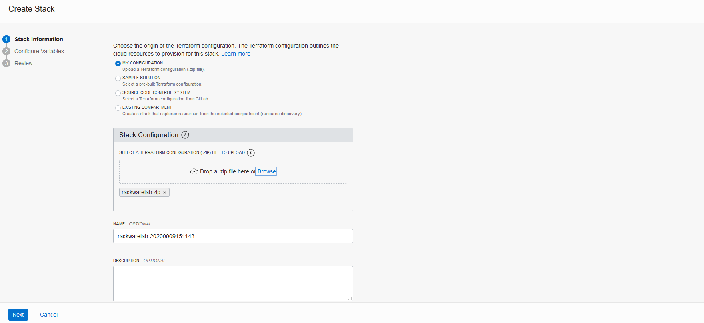
    
    ### Basic Input
    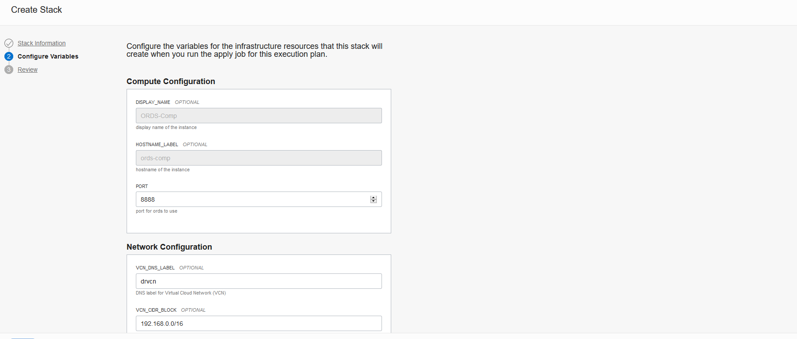
    
    ### Network
    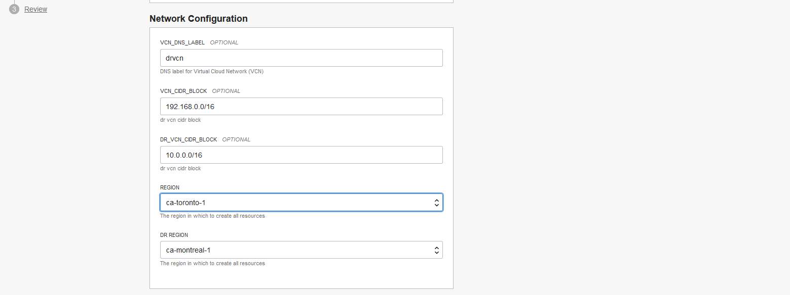
    
    ### Keys
    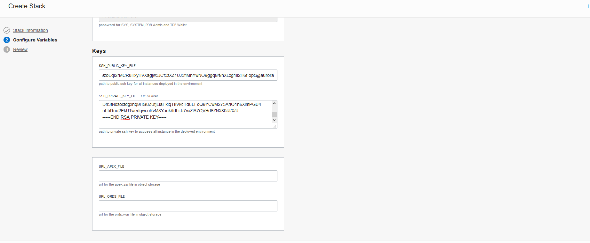
    
    ### Object Storage
    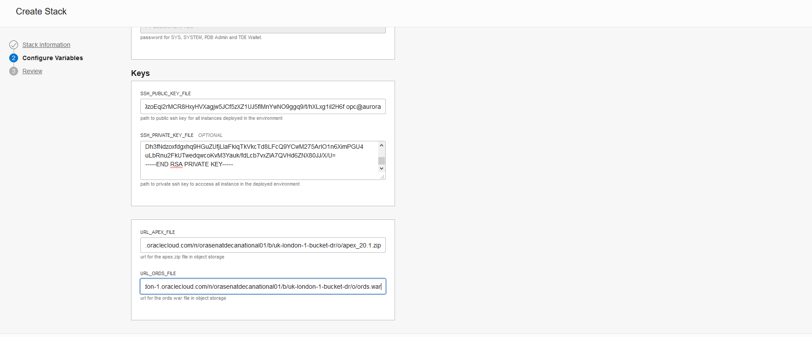
    
    ### Review
    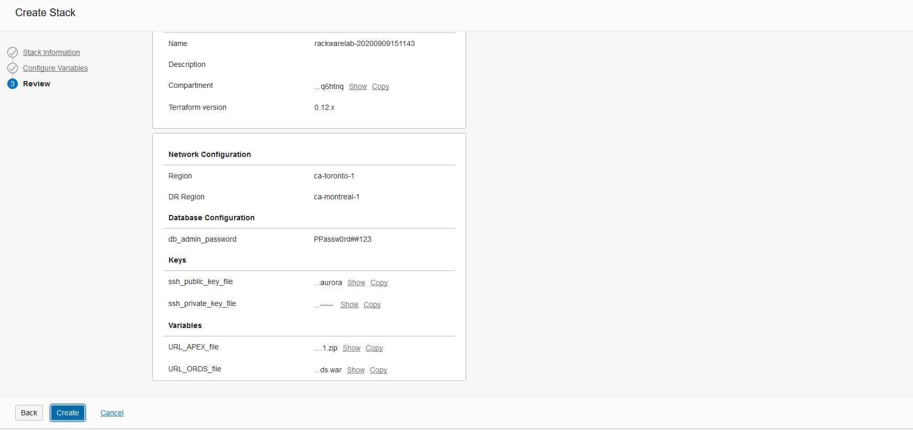
    
    ### Plans
    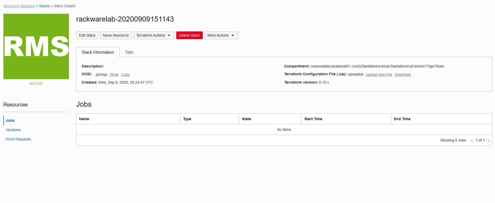
    
    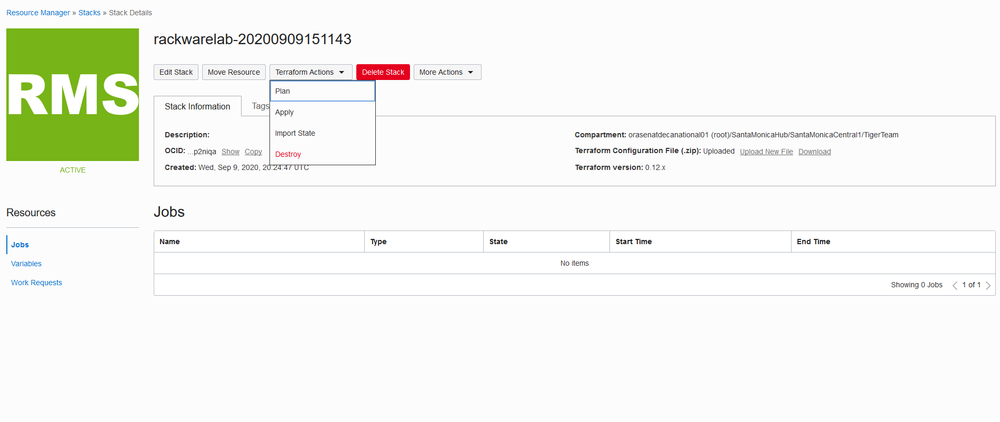
    
    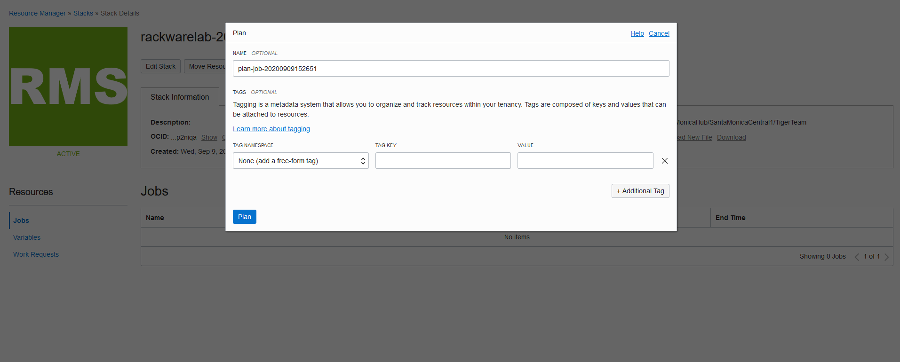
    
    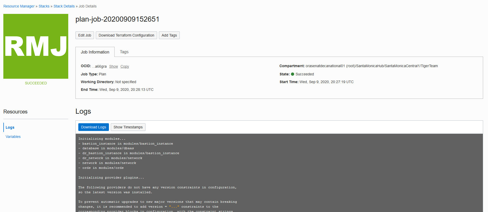
    
    ### Apply
    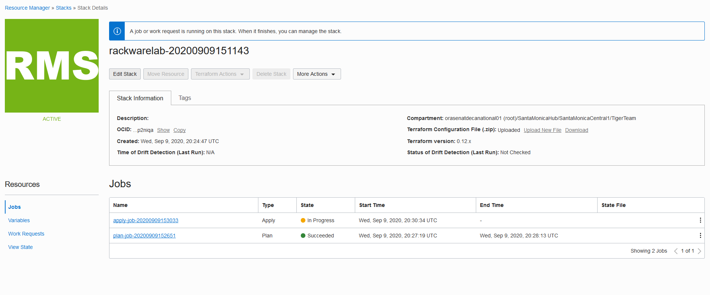
    
    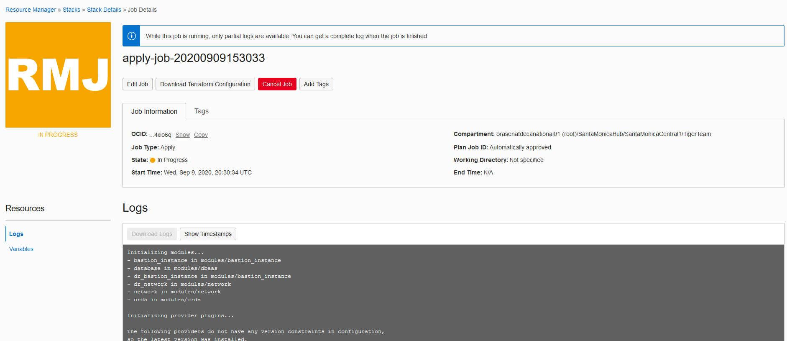

5. If you want to delete the infrastructure, run:
    First navigate to OCI Console and terminate the Standby database and once the termination is successfull then run the following command
    ```
    $ terraform destroy
    ```
    When you’re prompted to confirm the action, enter yes.

## Inputs required in the terraform.tfvars file
The following inputs are required for terraform modules:

| Argument                   | Description                                                                                                                                                                                                                                                                                                                                                       |
| -------------------------- | ----------------------------------------------------------------------------------------------------------------------------------------------------------------------------------------------------------------------------------------------------------------------------------------------------------------------------------------------------------------- |
| dr_region                         | standby region in which to operate, example: us-ashburn-1, us-phoenix-1, ap-seoul-1, ap-tokyo-1, ca-toronto-1> |
| dr_vcn_cidr_block                   | CIDR block of the VCN (Virtual Cloud Network) to be created in standby region. make sure the VCN CIDR blocks of primary and standby regions do not overlap  |
| vcn_cidr_block              | CIDR block of the VCN (Virtual Cloud Network) to be created in primary region. make sure the VCN CIDR blocks of primary and standby regions do not overlap|
| vcn_dns_label              | DNS Label of the VCN (Virtual Cloud Network) to be created.           |
| bastion_server_shape              |  This is compute shape for bastion server. For more information on available shapes, see [VM Shapes](https://docs.cloud.oracle.com/iaas/Content/Compute/References/computeshapes.htm?TocPath=Services#vmshapes)|
| db_display_name              |  The user-provided name of the Database Home|
| db_system_shape              |  The shape of the DB system. The shape determines resources allocated to the DB system.For virtual machine shapes, the number of CPU cores and memory and for bare metal and Exadata shapes, the number of CPU cores, memory, and storage. To get a list of shapes, use the [ListDbSystemShapes](https://docs.cloud.oracle.com/iaas/api/#/en/database/20160918/DbSystemShapeSummary/ListDbSystemShapes) operation.|
| db_admin_password              | A strong password for SYS, SYSTEM, PDB Admin and TDE Wallet. The password must be at least nine characters and contain at least two uppercase, two lowercase, two numbers, and two special characters. The special characters must be _, #, or -.  |


## Troubleshooting


### End